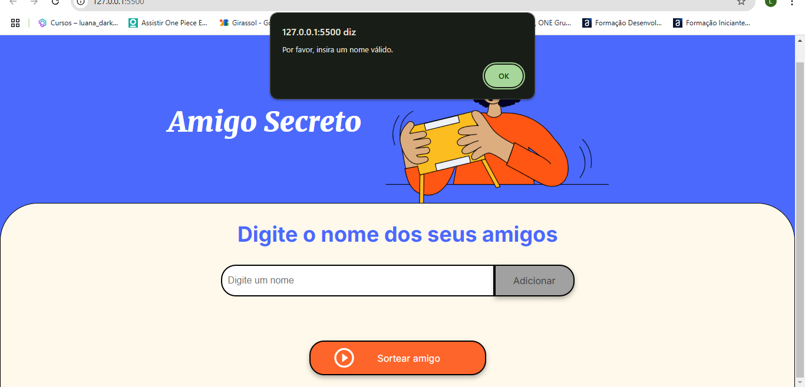
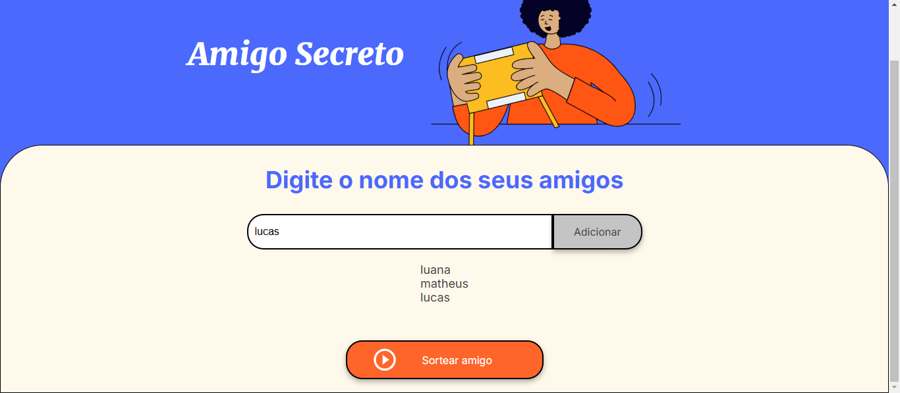
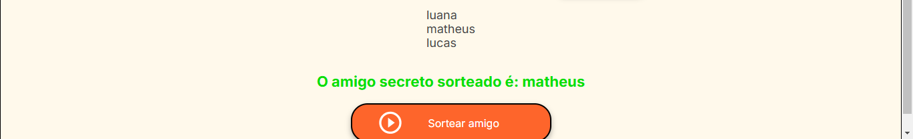

# Projeto " **Amigo Secreto**" 

## O que o projeto faz?

O projeto é um desafio da **ONE (Oracle Next Education)**. Como o próprio nome sugere, ele tem como objetivo sortear um amigo, simulando as tradicionais festas de amigo secreto.

O sistema permitirá que o usuário insira os nomes dos participantes. Todos os nomes serão armazenados em uma lista, que será exibida logo abaixo, visível ao usuário. Haverá também um botão chamado "**Sortear amigo**". Quando o usuário clicar nesse botão, uma pessoa será sorteada, e uma mensagem será exibida com o texto: "**O amigo secreto sorteado é: [nome da pessoa]**" .

Caso o usuário tente enviar um campo vazio, será exibido um alerta solicitando que você insira um nome válido.

### Erro ao clicar em "adicionar" com campo vazio:

### Lista sendo exibida ao ser adicionado um participante:

### Exibindo resultado ao clicar no botão "Sortear amigo":

## Redes socias

  
